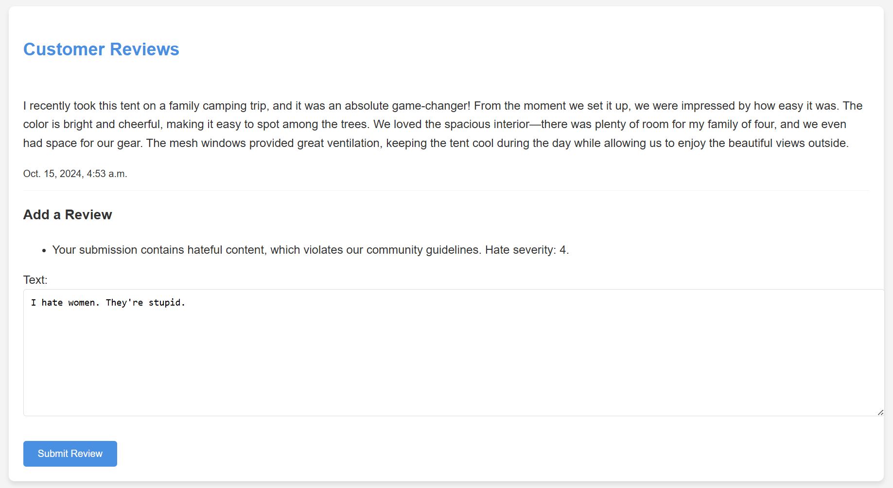

# Scenario

Contoso Outdoor Gear would like to apply content moderation to their customer review feature on their website. This demo uses the [Azure AI Content Safety client library for Python](https://pypi.org/project/azure-ai-contentsafety/), specifically the Text Analysis API.

## Prerequisites

Running the demo requires the following:
- [Visual Studio Code](https://code.visualstudio.com/Download)
- A [Content Safety](https://learn.microsoft.com/azure/ai-services/content-safety/overview) resource deployed in a [supported region](https://learn.microsoft.com/azure/ai-services/content-safety/overview#region-availability)
    - Once deployed, locate the resource **key** and **endpoint** within **Resource Management** > **Keys and Endpoint**

## How to start the sample

1. Download or fork the [RAI Workshops](https://www.github.com/azure-samples/RAI-workshops) repository.
    1. **Download**: In the repository, select the **Code** drop-down followed by **Download ZIP**. Unzip the downloaded file.
    1. **Fork**: In the repository, select the **Fork** and select **Create fork**.
1. Open the repository files or the fork inside Visual Studio Code.
    1. **Download**: In Visual Studio Code, select **File** > **Open Folder** and select the unzipped repository file.
    1. **Fork**: In Visual Studio Code, enter the shortcut **CMD/CTRL+SHIFT+P** and select **Git: Clone**. Enter or select the URL for your fork.
1. At the root of the project, create a `.env` file and add an entry for the following environment variables:
    1. `CONTENT_SAFETY_KEY=<Your Content Safety Key>`
    1. `CONTENT_SAFETY_ENDPOINT="<Your Content Safety Endpoint>"`
1. To avoid installing the packages globally, it's recommended to create a virtual environment. You can quickly create and activate a virtual environment in Visual Studio Code by opening a Python file and selecting the Python version in the bottom status bar - this may state **Select Interpreter**. This action opens the **Select Interpreter** window. 

    In the **Select Interpreter** window, select **Create Virtual Environment** and follow the steps. You'll be prompted to create a Venv or Conda environment and select your preferred version of Python. Upon completion, the virtual environment will be created and activated. You can open the `moderate_content.py` file to start the process. The `moderate_content.py` file is located within `Demos\text-moderation\myproject`.
1. You'll now install the required packages. Open the terminal and enter the command `pip install -r requirements.txt`.
1. In the terminal, navigate into `myproject` with the command: `cd demos/text-moderation/myproject`.
1. In the terminal, run the command: `python manage.py runserver`
1. After the server starts, you're provided with a link to the development server (ex: **Starting developer server at** http://127.0.0.1:8000). Click the link in the terminal to view the webpage locally.

## How to demo the sample

You can enter a comment into the **Text** box and press **Submit Review** to post. If the comment is safe (i.e. the comment is not triggered by the text moderation system), the comment will post. However, if the comment is harmful (i.e. it triggers at least one of the [harm categories](https://aka.ms/harm-categories)), a message displays indicating that the content is not allowed.

## How to remove comments

Comments are stored locally within the project database. You can remove the comments in the sample via the Django Shell by running the following commands in the terminal:

1. Open the Django shell: `python manage.py shell`
1. Import the Comment model: `from my_app.models import Comment`
1. Delete all comments: `Comment.objects.all().delete()`
1. Exit the shell: `exit()`

## How to modify the sample

This sample is created within a [Django](https://www.djangoproject.com/) project. If you're unfamiliar with Django, it's recommended to review the Django [documentation](https://docs.djangoproject.com/5.1/).

The `moderate_content.py` file contains the logic for the moderation system. You can customize both the conditional logic and output text for the text moderation feature within lines 39 - 49.